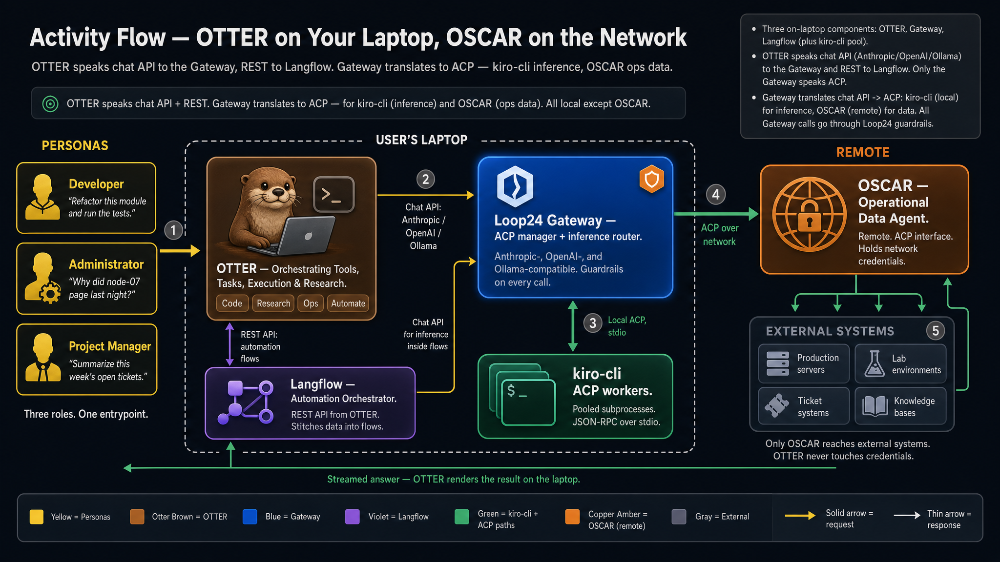

<!-- OTTER — the on-laptop coding & research assistant for the loop24 stack -->

# OTTER

> **O**rchestrating **T**ools, **T**asks, **E**xecution & **R**esearch — call it **OTTO** for short.

The on-laptop entrypoint for the **loop24** stack. A terminal-resident coding, research, and operations assistant for developers, administrators, and project managers — built to keep tool execution local while routing every LLM call through a governable gateway.



---

## What OTTER is

OTTER is the **client CLI** in the loop24 product family. It is what users actually open in a terminal:

- **One entrypoint for three roles.** A developer asks it to refactor and run tests. An administrator asks it why a node paged last night. A project manager asks it to summarize this week's open tickets. Same CLI, same conversational interface.
- **Local execution by default.** Filesystem, bash, git, and tool calls run on the developer's laptop. Nothing leaves the machine unless the task genuinely needs remote data or remote inference.
- **Chat API in, ACP out.** OTTER speaks standard chat-completion APIs (Anthropic / OpenAI / Ollama) to the Loop24 Gateway, and REST to a local Langflow. It never speaks raw ACP — the Gateway translates and routes downstream.
- **Compliance-friendly by construction.** When `LOOP24_GATEWAY_URL` is set, every LLM token routes through that gateway so governance, audit, and content moderation all live in one place. With no gateway configured, OTTER falls back to direct Anthropic.

OTTER is **not** a general-purpose AI assistant. It is a developer agent that also happens to trigger non-coding workflows through Langflow and reach into operational data through OSCAR.

This repo (`@cmetech/otto`, binary `otto`) is the **CLI** piece. The diagram above shows where it sits in the larger stack.

---

## Where OTTER fits in the loop24 stack

Everything inside the dashed laptop boundary in the diagram lives on the user's machine. Only OSCAR and the external systems behind it are remote.

| Component | Role | Where it lives | Relationship to OTTER |
|---|---|---|---|
| **OTTER** (this repo) | CLI client + conversation surface | Laptop | The user-facing entrypoint |
| **Loop24 Gateway** | Manages all ACP. Translates chat-API requests into ACP calls. Anthropic/OpenAI/Ollama-compatible. Hosts guardrails. | Laptop | OTTER's primary backend — every LLM call lands here first |
| **Langflow** | Low-code flow orchestrator for multi-step automations | Laptop | OTTER calls it via REST when a task is "automate" rather than "ask" |
| **kiro-cli ACP pool** | Pooled subprocess workers under the Gateway | Laptop | Where inference actually executes; OTTER never talks to them directly |
| **OSCAR** | Remote operations agent with an ACP interface. Holds network credentials. Reaches into production servers, lab environments, ticket systems, and knowledge bases. | Remote | Reached only via the Gateway's ACP channel — OTTER never holds ops credentials |

The two ACP connections (Gateway ↔ kiro-cli and Gateway ↔ OSCAR) are the load-bearing protocol relationships in the stack. OTTER itself is intentionally protocol-thin.

---

## Vision

> **The assistant carries the tools. The user keeps the keys.**

OTTER is built around a few non-negotiables:

**Local-first.** Tool execution, filesystem access, and developer state stay on the laptop. We don't ship work to a cloud worker when a local one will do.

**One governance surface.** Every LLM token routes through the Loop24 Gateway when configured. Guardrails — auth, rate limiting, content moderation, schema validation, audit — sit there, not scattered across clients. Add a policy in one place; it covers every surface.

**Extension-first.** New capabilities belong in the `loop24` extension, in skills, or in plugins — not in core. The core CLI stays lean. The terminal UI, the flow trigger system, and the prompt engineer all live as extensions.

**Provider-agnostic.** OTTER speaks Anthropic, OpenAI, or Ollama. The Gateway adapts to all three. No architectural decision should privilege one provider over another.

**Ship fast, fix fast.** Every release should work, but we'd rather ship and patch than delay and accumulate.

**What we won't build.** No DI containers. No abstract factories. No framework swaps without measurable improvement. No cosmetic refactors. No complexity without user value. No heavy orchestration that duplicates what the Gateway already provides.

---

## Status

**v0.x — early release.** The CLI is functional and published to npm. The OTTER brand is being introduced gradually; you will still see `loop24` as the package name, binary name, and config-directory name (`~/.loop24/`). That is intentional and stable — `loop24` is the implementation; OTTER is the product story.

---

## Quickstart

Requires **Node ≥22** on PATH.

### Install from npm (recommended)

```bash
npm install -g @cmetech/otto
otto
```

### Install from source (contributors)

```bash
git clone git@github.com:cmetech/otto-cli.git
cd otto-cli
./scripts/install.sh
```

The install script installs dependencies, builds the binary, symlinks `otto` into `~/.local/bin/`, and offers to launch the first-run config wizard so you can point OTTER at your gateway and (optionally) at Langflow.

After install (either path):

```bash
otto            # interactive TUI
otto --help     # subcommands
otto config     # re-run any part of the config wizard
```

See [`docs/INSTALL.md`](docs/INSTALL.md) for prerequisites, manual install, uninstall, and troubleshooting.

---

## What OTTER can do

OTTER classifies each user ask into one of four task types, shown as chips in the diagram above:

| Chip | What it means | Where it routes |
|---|---|---|
| **Code** | Refactor, generate, run tests, fix bugs | Chat API → Gateway → kiro-cli |
| **Research** | Investigate, explain, summarize, cite | Chat API → Gateway → kiro-cli |
| **Ops** | Pull live data from production, lab, tickets, or knowledge bases | Chat API → Gateway → OSCAR (via ACP over network) |
| **Automate** | Trigger or build a multi-step Langflow flow | REST → Langflow (local) |

### Commands provided by the `loop24` extension

| Command | Purpose |
|---|---|
| `/otto build-flow <description>` | Generate a Langflow flow JSON from a natural-language description |
| `/otto prompt-engineer <task>` | Polish a rough task description into a structured prompt for a coding agent |
| `/loop24 <flow-name>` | Trigger any Langflow flow declared in `extensions/loop24/commands/flow-triggers/*.yaml` |
| `/loop24 plan`, `/loop24 quick`, etc. | Multi-step workflow commands inherited from upstream — software-engineering recipes |

The extension also registers tools for catalog management, component inspection, flow validation, flow import, and smoke testing — see the extension manifest at `src/resources/extensions/loop24/extension-manifest.json`.

---

## Configuration

OTTER reads from `~/.loop24/config.json` (created by the first-run wizard) with env-var overrides:

| Env var | Purpose | Default |
|---|---|---|
| `LOOP24_GATEWAY_URL` | Loop24 Gateway URL — when set, all LLM traffic routes through it for governance | (none — direct to Anthropic) |
| `LOOP24_GATEWAY_TOKEN` | Optional Bearer auth for the Gateway | (none) |
| `LANGFLOW_SERVER_URL` | Local Langflow server for flow triggers | `http://127.0.0.1:7860` |
| `LANGFLOW_API_KEY` | Langflow API key (`x-api-key` header) | (none) |
| `ANTHROPIC_API_KEY` | Direct Anthropic key when no gateway is configured | (none) |
| `LOOP24_PYTHON_BIN` | Python 3 interpreter for build-flow tools | `python3` on PATH |
| `LOOP24_PROMPT_ENGINEER_MODEL` | Model for `/otto prompt-engineer` | `claude-haiku-4-5-20251001` |

Env vars always win over the config file. Run `otto config` to interactively set any subset (`gateway`, `langflow`, `llm`, or `all`).

---

## Architecture & compliance posture

The activity-flow diagram at the top of this README is the canonical picture of how a request becomes an answer. A few things worth calling out for governance reviewers:

1. **OTTER never speaks ACP.** All inter-agent protocol traffic is handled by the Loop24 Gateway. A compromised CLI surface cannot directly issue ACP commands.
2. **OTTER never holds ops credentials.** Credentials for production servers, ticket systems, and lab environments live with OSCAR (remote). OTTER asks; OSCAR fetches.
3. **One LLM egress point.** With `LOOP24_GATEWAY_URL` set, the laptop has exactly one outbound LLM destination. Audit log, content moderation, rate limiting, and schema validation are configured there, once.
4. **Local-only requests never leave the laptop.** OTTER classifies "Code" and "Research" asks; many resolve against kiro-cli locally without any network call beyond the laptop boundary.

The corresponding architecture diagram for the Gateway itself lives in [`docs/branding/loop24_architecture_infographic.jpg`](docs/branding/loop24_architecture_infographic.jpg). Both diagrams are generated from prompts checked into the same folder.

---

## Documentation

- [`docs/INSTALL.md`](docs/INSTALL.md) — install / uninstall / troubleshoot
- [`docs/branding/`](docs/branding/) — naming, logo prompts, infographics (activity flow + gateway architecture)
- [`docs/superpowers/specs/`](docs/superpowers/specs/) — design specifications
- [`docs/superpowers/plans/`](docs/superpowers/plans/) — implementation plans (one per phase)
- [`LOOP24-PATCHES.md`](LOOP24-PATCHES.md) — every fork edit and known deferred cleanups
- [`CONTRIBUTING.md`](CONTRIBUTING.md) — how to propose changes
- [`CHANGELOG.md`](CHANGELOG.md) — released versions

---

## Development

```bash
npm ci
npm run build
npm test
```

Plans live in [`docs/superpowers/plans/`](docs/superpowers/plans/) — one per phase, executed by subagents. The `loop24` extension source is in `src/resources/extensions/loop24/`.

---

## Fork attribution

OTTER (`@cmetech/otto`) is a **permanent hard fork** of [open-gsd/gsd-pi](https://github.com/open-gsd/gsd-pi) by Lex Christopherson, used under the MIT License. The upstream `gsd-pi` provides the agent core, the terminal UI, the extension system, and the multi-step workflow commands. OTTER adds:

- The `loop24` extension (Langflow flow triggers, flow builder, prompt engineer, catalog tools)
- Gateway routing for LLM traffic
- OTTER brand identity and terminal UI styling
- Compliance and audit posture

See [`LICENSE`](LICENSE) and [`LOOP24-PATCHES.md`](LOOP24-PATCHES.md) for the full list of fork edits.

---

## License

MIT — see [`LICENSE`](LICENSE). Inherited from upstream `gsd-pi`; copyright Lex Christopherson 2026.
