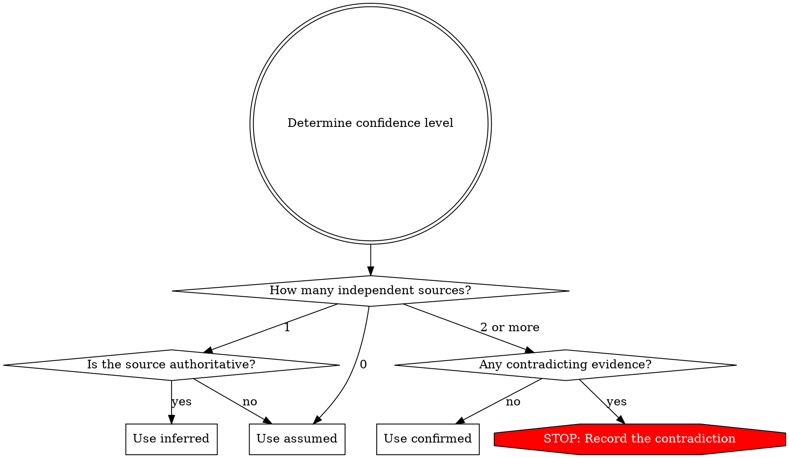
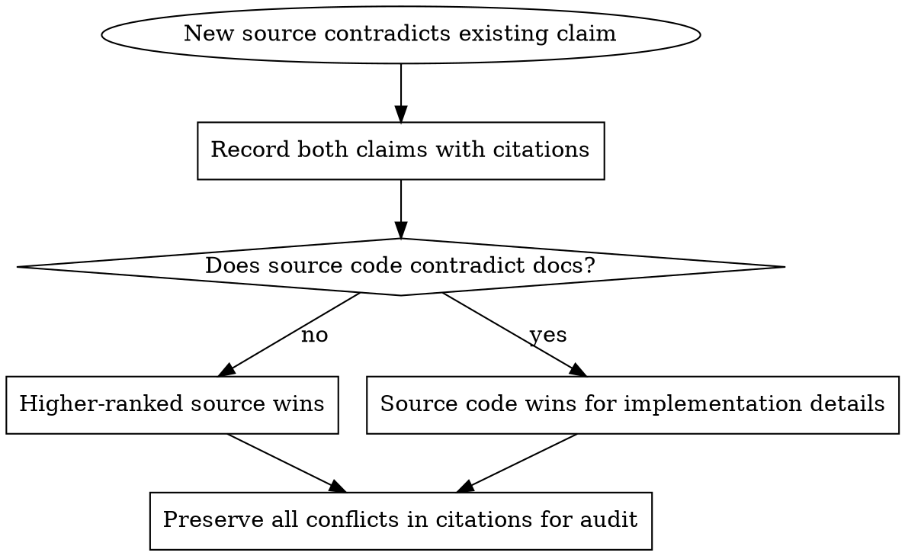

# Provenance Methodology

You are a general-purpose worker. You were dispatched with a role and told to Read this skill. Apply this provenance discipline to every behavioral claim you produce.

Every behavioral claim you write MUST have a citation. No exceptions.

## The Citation Rule

A "behavioral claim" is any assertion about what the target system does, how it responds, what data it accepts or produces, what errors it raises, what limits it enforces, or how it transitions between states.

**Cite as you go.** Do NOT batch citations at the end of your analysis. Every time you write a behavioral claim, the very next thing you write is the citation.

## Citation Format

Inline HTML comment, immediately after the claim. The core reference is the source file and line range:

```markdown
- Sessions expire after 30 minutes of inactivity
  <!-- cite: src/auth/session.ts:L42-L58 -->
```

When you need to record more than the file location (source type, confidence, corroboration), use the keyed form:

```markdown
- Sessions expire after 30 minutes of inactivity
  <!-- cite: source=official-docs, ref=https://docs.example.com/sessions#timeout, confidence=confirmed -->
```

### Reference Field

The `ref` (or the bare `<file>:Lx-Ly`) must point to a specific location:

- `src/auth/session.ts:L42-L58` (file with line range)
- `workspace/raw/source/analysis/chunk-023.md:45` (analysis file:line)
- `https://docs.example.com/auth#tokens` (specific URL)

### Required Fields (keyed form)

| Field | Type | Description |
|-------|------|-------------|
| `source` | enum | The type of source (see Source Types below) |
| `ref` | string | Specific location: `<file>:Lx-Ly`, a `workspace/` path with optional `:line`, or a URL |
| `confidence` | enum | `confirmed`, `inferred`, or `assumed` (see Confidence Levels below) |

### Optional Fields

| Field | Type | Description |
|-------|------|-------------|
| `corroborated_by` | comma-separated list | Other source types that independently confirm this claim |

### Placement Rules

- The `<!-- cite: -->` comment MUST appear on the line immediately following the claim it supports, or on the same line after the claim text.
- If a single claim is supported by multiple independent sources, use a single citation with `corroborated_by` listing the additional sources.
- If a paragraph contains multiple claims, each claim gets its own citation. Break compound sentences into separate cited items.
- Block-level claims (tables, code blocks, decision trees) place the citation comment immediately after the closing block.

## Source Types (Strongest to Weakest)

| Rank | Source Type | When to Use |
|------|-----------|-------------|
| 1 | `official-docs` | Published documentation, README, man pages, API references, changelogs |
| 2 | `public-api` | Observed behavior of public API endpoints, CLI commands |
| 3 | `sdk-analysis` | Published SDK, client library, or plugin source code |
| 4 | `community-knowledge` | Stack Overflow, blog posts, conference talks, third-party tutorials |
| 5 | `source-code` | Source code, bundles, minified JS |
| 6 | `inferred` | Reasoning, convention, analogy. No direct observation. |

## Confidence Levels

### `confirmed`

Two or more independent sources agree, OR a single observation with reproducible steps.

**Use when:**
- Official docs state X AND source code confirms X
- Two independent community sources describe X consistently
- A single reproducible observation (documented input, steps, output)

### `inferred`

One authoritative source, no contradictions.

**Use when:**
- Official docs state X but no second source confirms it
- Source code clearly implements X but no docs mention it
- A single well-regarded community source describes X, consistent with known behaviors

### `assumed`

Convention, pattern matching, or reasoning. No direct source.

**Use when:**
- Following a common convention (e.g., "REST API probably returns JSON") but no source confirms
- A pattern in one module is assumed to apply in another
- Evidence is partial and the claim is the most plausible interpretation
- Filling a spec gap where behavior must exist for the system to function

## How to Determine Confidence



**Authoritative sources:** official docs, source code, specific community content. **Not authoritative:** your own reasoning (always `assumed` unless corroborated).

## Confidence Escalation

Confidence can be upgraded but never downgraded without new contradicting evidence.

| From | To | Trigger |
|------|----|---------|
| `assumed` | `inferred` | A single authoritative source confirms the claim |
| `assumed` | `confirmed` | Two independent sources found, OR reproducible observation |
| `inferred` | `confirmed` | A second independent source found, OR reproducible observation |

When escalating, update the `<!-- cite: -->` comment with the new confidence level and add the confirming source to `corroborated_by`.

## Handling Contradictions



## Common Mistakes

**Citing everything as "confirmed" because you feel confident.**
`confirmed` requires 2+ independent sources. Your confidence in your own analysis is not a second source. One source = `inferred`. Period.

**Using `source=inferred` for everything you cannot directly cite.**
`source=inferred` means the claim was derived by reasoning. If you read it in docs, `source=official-docs`. If you saw it in code, `source=source-code`. Source type = where the evidence came from. Confidence = how sure you are.

**Omitting the `ref` field or using vague references.**
"ref=docs" is useless. "ref=source code" is useless. Use specific references:
- `ref=https://docs.example.com/auth#tokens` (specific URL)
- `ref=src/auth/session.ts:L42-L58` (file:line range)
- `ref=workspace/raw/source/analysis/chunk-023.md:45` (analysis file:line)

**Not recording assumed claims.**
Unrecorded assumptions look like confirmed facts to downstream workers and the implementer. Always cite assumed claims with `confidence=assumed`. List them in an Assumptions section. This is honesty, not weakness.

**Batching citations at the end.**
You forget sources. You guess at confidence. Citations become decoration instead of evidence. Cite as you go.
