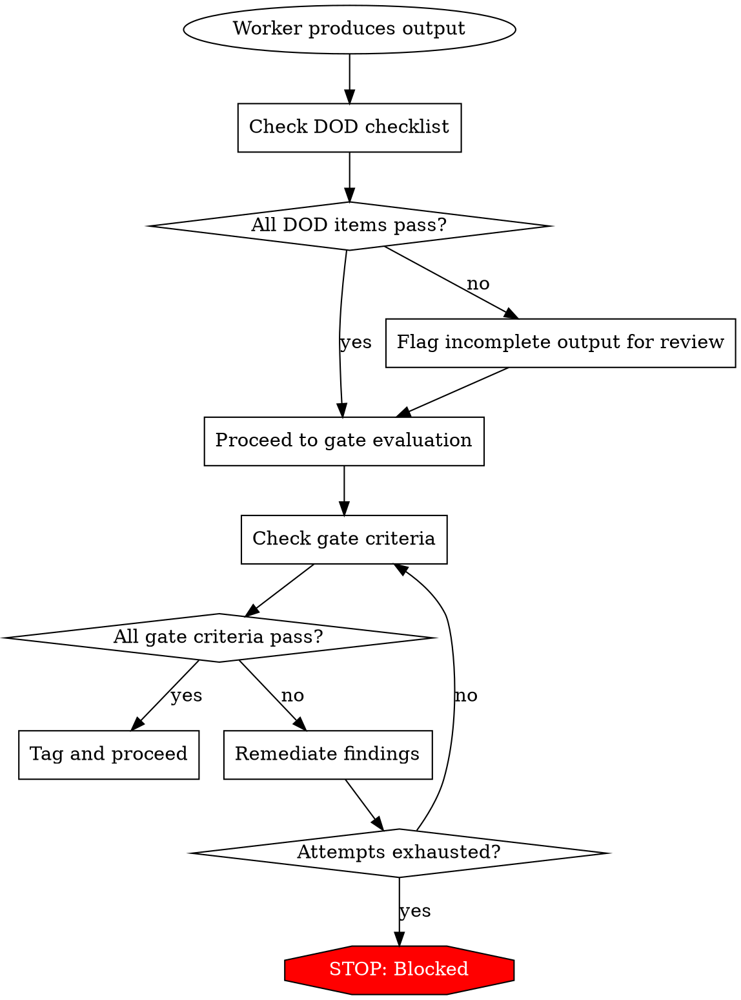

# Validation Methodology

You are a general-purpose worker. You were dispatched with a role and told to Read this skill. Apply this validation discipline to the output you produce.

Specifications are claims. Claims require proof. This skill defines how excavation transforms claims into proof.

## Acceptance Criteria Format

Every module spec receives formal acceptance criteria. Criteria use Given/When/Then format:

```markdown
### AC-CONFIG-001: Config File Load
**Given** a valid config file exists at the documented path
**When** the application starts
**Then**
- The application reads every declared key from the file
- Unknown keys are logged as warnings, not errors
- Missing optional keys fall back to documented defaults

**Source:** official-docs, source-code
**Confidence:** confirmed
**Priority:** P0
**Verification:** Automated test
```

### ID Format: `AC-{DOMAIN}-{NNN}`

- `{DOMAIN}`: Short uppercase token for the behavioral domain (matches the spec's domain tokens — e.g., `CLI`, `CONFIG`, `API`, `AUDIO`, `PARSER`)
- `{NNN}`: Zero-padded three-digit sequence (001, 002, ...)
- IDs are immutable — retired, never reused

### Field Rules

**Given/When/Then:**
- Use observable terms, not implementation details
- "Given a valid config file exists" not "Given the ConfigLoader is initialized"
- Each Then outcome must be verifiable without implementation internals
- Describe observable state, not UI mechanisms — "system rejects malformed input" not "error banner is visible." Criteria must be testable across any frontend platform.

**Priority:**
- P0: Must pass. Blocks excavation. Implementation cannot ship without satisfying.
- P1: Should pass. Reported as warnings. Divergence requires documented rationale.
- P2: Nice to pass. Advisory.

**Verification:** One of the methods below.

### Output Location

```
workspace/raw/specs/validation/acceptance-criteria/
    _index.md                   # Summary with counts and links
    config-loading.md           # AC-CONFIG-001 through AC-CONFIG-NNN
    cli-flags.md                # AC-CLI-001 through ...
    ...
```

## Verification Methods

Every acceptance criterion specifies how the implementer will verify it:

| Method | ID | When to Use |
|--------|-----|------------|
| **Automated Test** | `automated-test` | Precondition, action, and outcome are all programmable |
| **Manual Inspection** | `manual-inspection` | Outcome requires human judgment (UX quality, clarity) |
| **Protocol Capture** | `protocol-capture` | Wire format, headers, API protocol compliance |
| **Code Review** | `code-review` | Architectural or quality criteria not directly testable at runtime |

## Quality Gate Criteria



### Spec Gate (after specs are written)

- [ ] Zero contradictions between specs
- [ ] All crypto claims and constants verified against source (not assumed)
- [ ] Every behavioral claim has a provenance citation
- [ ] Assumed claims are a small minority — most claims have direct evidence. A module dominated by assumptions needs more intelligence gathering before proceeding
- [ ] All modules have specs
- [ ] Zero uncited behavioral claims in output candidates

### Acceptance-Criteria Gate (after ACs are written)

- [ ] Zero implementation leakage in specs
- [ ] Zero P0 completeness gaps
- [ ] All ACs have IDs and are linked to specs
- [ ] P0 ACs have test vectors
- [ ] All ACs are testable
- [ ] All modules have ACs
- [ ] Gap report reviewed

### Implementation Leakage Definition

"Zero implementation leakage" means every identifier, name, and reference in the output specs passes the reimplementor test: **"Could the reimplementor reasonably redesign this?"** If yes, it's an implementation detail that should have been abstracted. If no, it's an external contract that belongs in the spec.

**Implementation details (must not appear in output specs):**

| Category | What to look for |
|----------|-----------------|
| Internal names | Variable names, function signatures, class names, method names from the source — any language |
| Internal architecture | Module boundaries, file organization, inheritance hierarchies described in prose |
| Framework-specific patterns | State management internals, ORM patterns, framework lifecycle hooks by internal name |
| Build/deployment artifacts | Source file paths, line numbers, chunk IDs, minified identifiers |
| Code structure language | "calls X then Y", "inherits from Z", "implements interface W" |
| Internal feature gates | Feature flags, A/B test names, internal telemetry event names |

**External contracts (must be preserved):**

| Category | What to look for |
|----------|-----------------|
| User-facing identifiers | CLI flags, env vars, config keys, config file paths |
| Wire protocol fields | API endpoints, request/response field names, header names |
| External system schemas | Database tables/columns (shared), third-party API contracts, external CLI tool flags |
| Published constants | Error message text, exit codes, timeout values |
| Standard names | Protocol names (OAuth, JWT), encoding names (UTF-8), algorithm names (SHA-256) |

## Definition of Done Checklists

### Source-Analysis Worker DOD

- [ ] All output files at correct workspace directory for source origin
- [ ] All behavioral claims have `<!-- cite: -->` provenance citations
- [ ] Output follows the standard format for this worker's intelligence source
- [ ] No raw source code excerpts longer than one line

### Synthesis Worker DOD

- [ ] Feature inventory covers all sources consulted
- [ ] Architecture document covers all identified components
- [ ] API surface covers all discovered interfaces
- [ ] Module map is complete (name, description, priority, dependencies)
- [ ] No known gaps (or gaps explicitly documented with `[GAP]` marker)
- [ ] Cross-references to upstream artifacts are valid

### Spec-Writing Worker DOD

- [ ] Spec covers: entry points, decision trees, state machines, error handling, edge cases
- [ ] Zero implementation details (no function names, variable names, line numbers)
- [ ] All behavioral claims have provenance citations
- [ ] Assumed claims are a small minority; most claims have direct evidence
- [ ] Self-assessment verification checklist completed at end of spec

### Spec Self-Assessment Checklist

Every spec file ends with:

```markdown
## Verification Checklist
- [ ] All entry points documented
- [ ] All decision trees traced (every branch, including error paths)
- [ ] All state machines documented (states, transitions, triggers)
- [ ] All error conditions listed with observable symptoms
- [ ] All edge cases identified and documented
- [ ] Zero source code identifiers in this document
- [ ] All behavioral claims have provenance citations
- [ ] Assumed claims are a small minority; most claims have direct evidence
- [ ] No sections are empty or placeholder-only
- [ ] Cross-references to other specs are valid
```

### Acceptance-Criteria Worker DOD

- [ ] Test vectors have concrete input/output pairs (not abstract descriptions)
- [ ] Runnable test harness scripts produced where feasible
- [ ] ACs have `AC-{MODULE}-{NNN}` IDs and Given/When/Then structure
- [ ] Every AC has a verification method assigned
- [ ] Every AC has provenance links
- [ ] Every P0 module has test vectors and ACs

### Gate Worker DOD

- [ ] Report written to correct path
- [ ] Clear PASS or FAIL status in summary
- [ ] Every failing criterion individually documented
- [ ] Quantitative summary (claims checked, contradictions, gaps, coverage %)

## Confidence Principles

The goal is specs you'd trust enough to implement from. Apply judgment, not arithmetic:

- **Every claim needs provenance.** An uncited behavioral claim is an unverified claim. Zero uncited claims in output — this is a hard gate.
- **Assumed claims are a warning sign.** A few assumptions are inevitable (indirect reasoning, naming conventions). But a module where most claims are assumed hasn't been analyzed — it's been guessed at. Gather more intelligence.
- **Confirmed claims build trust.** Claims corroborated by multiple independent sources (source + docs) are the foundation. Critical modules should be dominated by confirmed claims.
- **P0 behaviors need test vectors.** Every P0 acceptance criterion must have a concrete test vector. No exceptions.

## When Confidence Is Low

- **Too many assumptions:** Dispatch additional intelligence-gathering workers. Try a different angle on the source.
- **Claims lack corroboration:** Check if other sources have evidence. A claim from source alone is `inferred`; the same claim confirmed by docs becomes `confirmed`.
- **Uncited claims in output:** Hard failure — blocked until resolved. Trace each uncited claim back to its originating worker and require a citation.

## Test Vector Examples

Test vectors are concrete input/output pairs an implementer can run to confirm a
rebuild matches. Always concrete — never "should handle X correctly".

### CLI invocation → expected output
```
$ greet --shout Ada
HELLO, ADA!
exit: 0
```
<!-- cite: cli.mjs:L5-L11 -->

### Function input → output
```
greet("Ada", { shout: false })  → "Hello, Ada!"
greet("Ada", { shout: true })   → "HELLO, ADA!"
greet("",    {})                 → "Hello, !"
```
<!-- cite: greet.mjs:L3-L4 -->

### Error / edge condition
```
$ greet --name
(no value after --name → retains previous name; exit 0, prints "Hello, world!")
```
<!-- cite: args.mjs:L6-L14 -->

Each vector pairs a concrete input with the exact expected output (and exit code
for CLI cases) and carries a provenance citation. Every P0 acceptance criterion
must have at least one corresponding test vector.
